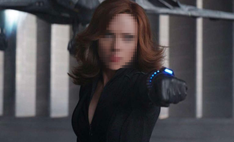
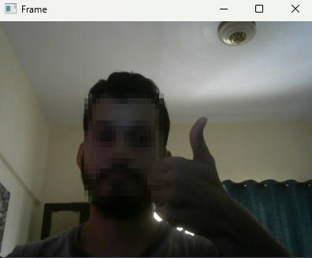

# Face Blur and Anonymize Faces with OpenCV and Python
A Python project that automatically detects faces in images and video streams (using OpenCV's DNN-based face detector) and anonymizes them using either a **Gaussian blur** or a **pixelation** effect.

## Demo
Image Pixelated Detection 
| Original | Pixelated |
|---|---|
|  |  |

Video Frame Pixelated Detection



## Project Structure

```
Blurring_Face_Project
├── examples
│   ├── chris_evans.png
│   ├── robert_downey_jr.png
│   ├── scarlett_johansson.png
│   └── tom_king.jpg
├── face_detector
│   ├── deploy.prototxt
│   └── res10_300x300_ssd_iter_140000.caffemodel
├── microimagesearch
│   ├── face_blurring.py
├── blur_face.py
└── blur_face_video.py
```

- **`examples/`** — sample images used to test the pipeline
- **`face_detector/`** — pre-trained Caffe-based SSD face detector (prototxt + weights)
- **`microimagesearch/face_blurring.py`** — core blurring/pixelation logic
- **`blur_face.py`** — runs face anonymization on a single image
- **`blur_face_video.py`** — runs face anonymization in real time on a webcam stream

## How It Works

1. A pre-trained **SSD face detector** (Caffe model, `res10_300x300_ssd_iter_140000.caffemodel`) locates faces in each frame/image.
2. Each detected face region (ROI) is cropped out.
3. The ROI is anonymized using one of two methods:
   - **`simple`** — applies a strong Gaussian blur over the whole face.
   - **`pixelated`** — divides the face into an N×N grid of blocks and replaces each block with its average color, creating a classic "censored" pixelation effect.
4. The anonymized face is written back into the original frame/image.

## Requirements

```
numpy==1.24.4
opencv-contrib-python==4.8.1.78
imutils==0.5.4
```

Install with:

```bash
pip install -r requirements.txt
```

## Usage

### 1. Blur faces in an image

```bash
python blur_face.py --image examples/scarlett_johansson.png --face face_detector --method pixelated --blocks 20
```

**Arguments:**

| Flag | Description | Default |
|---|---|---|
| `-i, --image` | Path to input image | *required* |
| `-f, --face` | Path to face detector model directory | *required* |
| `-m, --method` | `simple` or `pixelated` | `simple` |
| `-b, --blocks` | Number of blocks per axis for pixelation | `20` |
| `-c, --confidence` | Minimum detection confidence | `0.5` |

### 2. Blur faces in a live webcam stream

```bash
python blur_face_video.py --face face_detector --method pixelated --blocks 20
```

Press **`q`** to quit the video stream.

**Arguments:**

| Flag | Description | Default |
|---|---|---|
| `-f, --face` | Path to face detector model directory | *required* |
| `-m, --method` | `simple` or `pixelated` | `simple` |
| `-b, --blocks` | Number of blocks per axis for pixelation | `20` |
| `-c, --confidence` | Minimum detection confidence | `0.5` |

## Notes

- Lower `--blocks` values (e.g. 3–5) produce a chunkier, more anonymized look; higher values (e.g. 30+) retain more detail and may reduce the anonymization effect.
- Make sure the `microimagesearch` folder name matches the import statements used in `blur_face.py` / `blur_face_video.py`.

## Credits

Face detection model based on OpenCV's res10 SSD Caffe model. Blurring/pixelation logic inspired by classic face anonymization tutorials.
